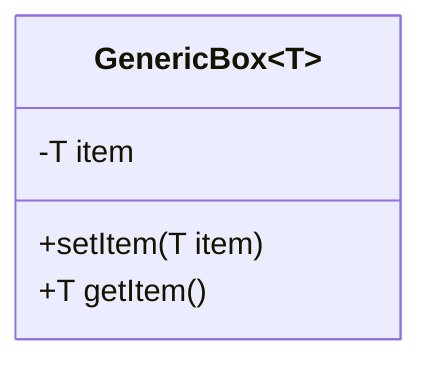

# Java Kata Template Documentation

This document explains how to use the kata template system and all available features for creating rich, interactive Java katas for the dojo.

## File Structure

```
TEMPLATE.md                  # Clean template ready to copy
README_TEMPLATE.md          # This documentation file
your-kata-name.md           # Your kata using the template
```

## Getting Started

1. Copy `TEMPLATE.md` to `your-kata-name.md`
2. Replace all placeholder text with your content
3. Add your kata to `katas.json`
4. Test in the kata viewer

## Advanced Features Available

### Interactive Knowledge Check System

**Any section ending with "Knowledge Check" is automatically rendered as interactive quizzes:**

- **Pre-Dialog Knowledge Check**: Test understanding before the lesson
- **Post-Kata Knowledge Check**: Validate learning after completion  
- **Mid-Lesson Knowledge Check**: Check progress during the kata

**Features:**

- ✅ Clickable multiple choice answers
- ✅ Immediate visual feedback (green for correct, red for incorrect)
- ✅ Animated checkmarks for correct answers
- ✅ Shake animation for incorrect answers
- ✅ Inline code rendering with syntax highlighting

### Code Rendering Features

**Syntax Highlighting with Prism.js:**

```java
// All code blocks get automatic syntax highlighting
public class Example<T> {
    private T item;
    
    public void setItem(T item) {
        this.item = item;
    }
}
```

**Inline Code Styling:**

- Use backticks for inline code: `class Box<T>`
- Automatically styled with gold theme
- HTML characters properly escaped: `<T>` renders correctly
- Works in question titles and answer options

**Automatic Line Numbering:**

- All code blocks get line numbers
- Trailing empty lines automatically removed
- Consistent with dojo visual theme

### Mermaid Diagram Support

**Class Diagrams:**



**Sequence Diagrams:**

```mermaid
sequenceDiagram
    participant Client
    participant Box
    Client->>Box: setItem("Hello")
    Box-->>Client: void
    Client->>Box: getItem()
    Box-->>Client: "Hello"
```

### Front Matter Configuration

**Required Fields:**

```yaml
---
title: "Kata Title"
subject: "Main concept"
goal: "Learning objective"
level: "Beginner|Intermediate|Advanced"
duration: "20-25 minutes"
category: "Abstraction|Generics|Polymorphism"
difficulty: "beginner|intermediate|advanced"
---
```

**Optional Fields:**

```yaml
concepts:
  - "List of concepts"
prerequisites:
  - "Required knowledge"
estimated_time: 25
ninja_belt: "white|orange|red"
```

## Adding to the Viewer

Add your kata to `katas.json`:

```json
{
  "title": "Your Kata Title",
  "file": "your-kata.md",
  "subject": "Java Concept",
  "level": "Beginner",
  "duration": "25 min",
  "category": "Generics"
}
```

## Style Guidelines

### Dialogue Format

- **Sensei:** Use for teaching moments and wisdom
- **Deshi:** Use for questions and confusion  
- *Italics* for narrative and scene setting

### Code Examples

- Use fenced code blocks with language specification
- Include both correct and incorrect examples
- Show expected output when helpful
- Use `// TODO:` comments for student implementation

### Knowledge Check Questions

- Always include both pre and post knowledge checks
- Use 3 questions with 4 options each
- Include code examples in questions when relevant
- Provide answer key: `> Answers : 1:c;2:b;3:c`

### Japanese Elements

- Include relevant Japanese terms with translations
- Use traditional concepts (道, 練習, 実践, 反省, etc.)
- Maintain respectful tone throughout
- Include Japanese section headers where appropriate

### Structure Guidelines

- Keep sections balanced in length
- Include practical hands-on elements
- Progress from simple to complex
- End with actionable takeaways
- Link to related concepts

## Content Guidelines

### Educational Approach

- **Practical**: Focus on real-world scenarios
- **Progressive**: Build complexity gradually  
- **Interactive**: Include practice exercises and knowledge checks
- **Memorable**: Use storytelling and metaphors
- **Comprehensive**: Cover common pitfalls and edge cases

### Technical Requirements

- **Type Safety**: Always show before/after comparisons
- **Error Prevention**: Demonstrate compile-time vs runtime errors
- **Best Practices**: Include naming conventions and patterns
- **Testing**: Provide clear verification steps

### Visual Elements

- **Diagrams**: Use Mermaid for class/sequence diagrams
- **Code Highlighting**: Leverage Prism.js automatic highlighting  
- **Inline Code**: Use backticks for technical terms
- **Emphasis**: Use **bold** for important concepts

## Template Placeholders

Replace these placeholders in the template:

### Front Matter Placeholders

- `Your Kata Title` → Actual kata title
- `Main Java concept` → The primary concept being taught
- `What the student will learn` → Clear learning objective
- `Beginner|Intermediate|Advanced` → Choose appropriate level
- `20-25 minutes` → Realistic time estimate
- `Abstraction|Generics|Polymorphism` → Choose appropriate category

### Content Placeholders

- `[main concept]` → The main concept you're teaching
- `[concept]` → Specific aspect of the concept
- `[Problem Description]` → Title for the problem section
- `[demonstrate problem]` → Show the problem in context
- `[solution]` → Your proposed solution
- `[Task Name]` → Name for each implementation task
- `[explanation]` → Your explanation of the concept

### Knowledge Check Placeholders

- Replace example questions with relevant ones for your topic
- Update answer options to match your concept
- Ensure answer key matches your correct options
- Include code examples relevant to your kata

### Code Placeholders

- Replace example class names with your domain
- Use meaningful variable and method names
- Include relevant comments and TODOs
- Show realistic before/after examples

## Testing Your Kata

1. **Content Review**: Ensure all placeholders are replaced
2. **Knowledge Checks**: Verify questions test the right concepts  
3. **Code Examples**: Test that code compiles and runs
4. **Viewer Integration**: Test in the kata viewer
5. **User Testing**: Have someone else try your kata

## Best Practices

### Content Creation

- Start with learning objectives
- Map content to objectives
- Include realistic examples
- Test with target audience

### Interactive Elements

- Use knowledge checks strategically
- Balance text and code examples
- Include visual diagrams where helpful
- Make exercises progressively challenging

### Technical Quality

- Ensure all code examples are correct
- Test Mermaid diagrams render properly
- Verify inline code formatting
- Check all links and references

## Common Issues and Solutions

### Knowledge Check Problems

- **Questions too easy/hard**: Adjust difficulty to match kata level
- **Unclear options**: Make each option clearly right or wrong
- **Missing answer key**: Always include `> Answers : 1:c;2:b;3:c`

### Code Rendering Issues

- **Missing syntax highlighting**: Specify language in code fence
- **Broken inline code**: Use backticks and avoid special characters
- **Trailing blank lines**: The system removes these automatically

### Mermaid Diagram Issues

- **Syntax errors**: Validate diagrams on mermaid.live
- **Complex diagrams**: Keep diagrams simple and focused
- **Mobile display**: Test diagram readability on small screens

## Resources

- [Mermaid Documentation](https://mermaid.js.org/)
- [Prism.js Language Support](https://prismjs.com/#supported-languages)
- [Markdown Guide](https://www.markdownguide.org/)
- [YAML Front Matter](https://jekyllrb.com/docs/front-matter/)

---

*Happy kata creation! 🥋*
