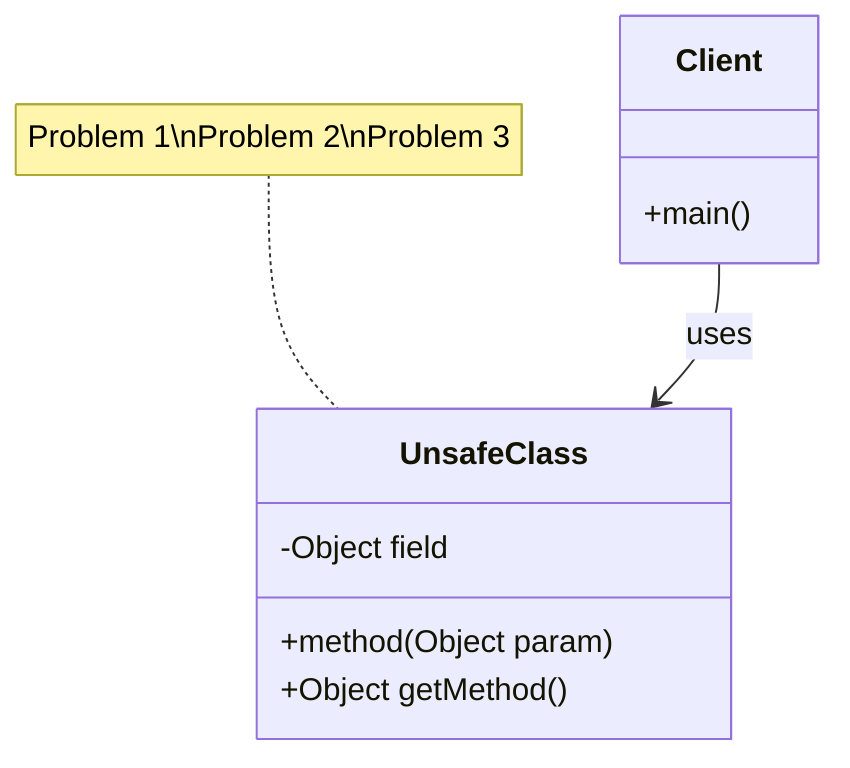

---
title: "Your Kata Title"
subject: "Main Java concept (e.g., Generic Types and Type Safety)"
goal: "What the student will learn"
level: "Beginner|Intermediate|Advanced"
duration: "20-25 minutes"
category: "Abstraction|Generics|Polymorphism"
difficulty: "beginner|intermediate|advanced"
concepts:
  - "Concept 1"
  - "Concept 2"
  - "Concept 3"
prerequisites:
  - "Required knowledge 1"
  - "Required knowledge 2"
estimated_time: 25
ninja_belt: "white|orange|red"
---

## Pre-Dialog Knowledge Check

Before beginning your journey with Sensei, test your understanding:

### Question 1: What is the primary benefit of [concept]?

a) Option A
b) Option B  
c) Compile-time type safety and elimination of casting
d) Option D

### Question 2: In the declaration `class Box<T>`, what does `T` represent?

a) A concrete type like String
b) A type parameter that will be replaced with an actual type
c) A method name
d) A variable name

### Question 3: What happens when you try to compile this code?

```java
Box<String> box = new Box<>();
box.setItem(42); // Trying to put Integer in String box
```

a) Runtime ClassCastException
b) The program runs with warnings
c) Compile-time error preventing the mistake
d) Automatic type conversion

> Answers : 1:c;2:b;3:c

---

## 道場での対話 (Dojo Dialogue)

*Sensei:* Welcome, young developer. Today we begin our journey into [main concept]. Like a craftsman who chooses the right tool for each task, [concept] helps us write better code.

*Deshi:* Sensei, I've heard that [concept] is complex. Is it really necessary?

*Sensei:* Observe this example, student. See how [demonstrate problem]?

```java
// Problem example
public class UnsafeExample {
    private Object item;
    
    public void setItem(Object item) {
        this.item = item;
    }
    
    public Object getItem() {
        return item; // Requires casting!
    }
}
```

*Deshi:* Yes, and what if I make a mistake?

*Sensei:* Precisely! You would face runtime errors. But with [solution], such errors are caught at compile time.

---

## The Problem: [Problem Description]



*Sensei:* The current approach has three problems:

1. **Problem 1**: Description
2. **Problem 2**: Description  
3. **Problem 3**: Description

---

## Your Mission

Transform the unsafe code into a better implementation:

### Task 1: [Task Name]

Convert the unsafe class to use [concept]:

```java
// BEFORE (problematic)
public class UnsafeClass {
    private Object field;
    
    public void setField(Object value) {
        this.field = value;
    }
    
    public Object getField() {
        return field;
    }
}

// AFTER (your implementation)
public class SafeClass<T> {
    // TODO: Implement using generics/abstraction
}
```

*Deshi:* How do I implement this, Sensei?

*Sensei:* Replace `Object` with the appropriate abstraction. The key is to [explanation].

### Task 2: [Additional Task]

Implement utility methods:

```java
// BEFORE
public static Object findFirst(Object[] array) {
    // Returns Object - requires casting
}

// AFTER (your implementation)
public static <T> T findFirst(T[] array) {
    // TODO: Implement generic version
}
```

---

## Expected Results

After implementation, your code should work like this:

```java
// Type-safe usage example
SafeClass<String> stringInstance = new SafeClass<>();
stringInstance.setField("Hello");
String value = stringInstance.getField(); // No casting needed!

// Additional examples
SafeClass<Integer> intInstance = new SafeClass<>();
intInstance.setField(42);
Integer number = intInstance.getField(); // Type-safe!
```

---

## Key Concepts to Master

*Sensei:* Focus on these fundamental concepts:

1. **Concept 1**: `<T>` declares a placeholder for a type
2. **Concept 2**: Generic classes accept type parameters
3. **Concept 3**: Compile-time safety prevents runtime errors
4. **Concept 4**: Code reusability without sacrificing type safety

*Deshi:* What are the naming conventions?

*Sensei:* Follow these conventions:

- `T` - Type (general purpose)
- `E` - Element (collections)
- `K` - Key (maps)
- `V` - Value (maps)
- `N` - Number

---

## Running the Tests

Execute your tests to verify the implementation:

```bash
mvn test -Dtest=YourTestClass
```

The tests will guide you through the transformation.

---

## Post-Kata Knowledge Check

Now that you've completed the kata, test your understanding:

### Question 1: What is the main advantage of your new implementation?

a) It uses less memory
b) It runs faster at runtime
c) It prevents ClassCastException by catching type errors at compile time
d) It automatically converts types

### Question 2: In your generic method, what does the type parameter represent?

a) The return type only
b) A placeholder that will be replaced with an actual type
c) A constraint on the input
d) A Java keyword

### Question 3: If you create an instance with specific types, what happens to type safety?

a) Types are erased at runtime
b) All operations become type-safe at compile time
c) Performance decreases
d) Memory usage increases

> Answers : 1:c;2:b;3:b

---

## Reflection Questions

*Sensei:* Before we conclude, meditate on these questions:

1. How does [concept] improve code safety?
2. What happens when you try to violate type constraints?
3. Why is compile-time detection better than runtime errors?
4. How does this make code more maintainable?

*Deshi:* This approach seems much safer and cleaner!

*Sensei:* Indeed. You have taken an important step in your journey. Remember: *"In [concept], we find safety without sacrificing flexibility."*

---

## Next Steps

Once you master these basics, you'll be ready for:

- Advanced topic 1
- Advanced topic 2  
- Complex patterns and relationships

Practice well, and mastery will follow.

---

*"The wise programmer writes once, compiles safely, and runs without fear."* - Ancient Java Proverb
