## 道場での対話 (Dojo Dialogue)

### Scene: The Legacy Code Challenge

*The deshi stares at a massive Java file on their screen, overwhelmed by its complexity. The sensei approaches, having witnessed this struggle countless times.*

**Sensei:** "I see the weight of legacy code upon your shoulders, advanced deshi. What troubles you?"

**Deshi:** "Sensei, I have inherited this `MonolithicDataProcessor` class. It processes CSV, JSON, and XML data with validation, filtering, and aggregation. But it's over 400 lines of tangled logic! Every small change risks breaking something else, and adding new features is becoming impossible."

**Sensei:** "Ah, the classic monolith - where all concerns live as one. This is not code, but chaos. However, within this chaos lies an opportunity to practice the highest forms of abstraction mastery. Come, let me show you the path from monolith to mastery."

---

## The Teaching

**Sensei:** "First, observe the monolithic beast you must tame. Look at the current `MonolithicDataProcessor`:"

```java
public class MonolithicDataProcessor implements DataProcessor {
    
    /**
     * This method demonstrates the problems of a monolithic approach:
     * - Mixed concerns (reading, processing, validation)
     * - Difficult to test individual parts
     * - Hard to add new data sources or transformations
     * - No reusability
     */
    public long processFileData(String filename, String format, boolean validate, 
                               String categoryFilter, String aggregationType) {
        // 380+ lines of deeply mixed concerns:
        
        try {
            // File loading - Apache Commons IO
            String content = IOUtils.toString(
                getClass().getClassLoader().getResourceAsStream(
                    "org/buildozers/dojo/abstraction/advanced/" + filename
                ), StandardCharsets.UTF_8);
            
            if ("CSV".equals(format)) {
                // Validation mixed with parsing
                if (validate) {
                    CSVParser parser = CSVParser.parse(content, 
                        CSVFormat.DEFAULT.builder().setHeader().setSkipHeaderRecord(true).build());
                    for (CSVRecord csvRecord : parser) {
                        if (csvRecord.size() != 4) {
                            throw new DataProcessingException("CSV record inconsistency...");
                        }
                        // More validation logic mixed in...
                    }
                }
                
                // Parsing mixed with filtering and aggregation
                CSVParser parser = CSVParser.parse(content, 
                    CSVFormat.DEFAULT.builder().setHeader().setSkipHeaderRecord(true).build());
                long result = 0;
                for (CSVRecord csvRecord : parser) {
                    String category = csvRecord.get("category");
                    if (categoryFilter == null || categoryFilter.isEmpty() || category.equals(categoryFilter)) {
                        if ("SUM".equals(aggregationType)) {
                            result += (long) Double.parseDouble(csvRecord.get("value"));
                        } else if ("COUNT".equals(aggregationType)) {
                            result++;
                        }
                    }
                }
                return result;
                
            } else if ("JSON".equals(format)) {
                // JSON processing with schema validation
                JSONObject jsonObject = new JSONObject(content);
                if (validate) {
                    // Everit JSON Schema validation mixed in
                    org.everit.json.schema.Schema schema = SchemaLoader.load(schemaObject);
                    schema.validate(jsonObject);
                }
                
                // Parsing, filtering, aggregation all mixed together
                JSONArray dataArray = jsonObject.getJSONArray("data");
                long result = 0;
                for (int i = 0; i < dataArray.length(); i++) {
                    JSONObject record = dataArray.getJSONObject(i);
                    String category = record.getString("category");
                    if (categoryFilter == null || categoryFilter.isEmpty() || category.equals(categoryFilter)) {
                        if ("SUM".equals(aggregationType)) {
                            result += record.getLong("value");
                        } else if ("COUNT".equals(aggregationType)) {
                            result++;
                        }
                    }
                }
                return result;
                
            } else if ("XML".equals(format)) {
                // XML DOM parsing with XSD validation
                if (validate) {
                    SchemaFactory schemaFactory = SchemaFactory.newInstance(XMLConstants.W3C_XML_SCHEMA_NS_URI);
                    Schema schema = schemaFactory.newSchema(xsdSource);
                    Validator validator = schema.newValidator();
                    validator.validate(new StreamSource(new StringReader(content)));
                }
                
                // DOM parsing mixed with filtering and aggregation
                DocumentBuilderFactory factory = DocumentBuilderFactory.newInstance();
                factory.setNamespaceAware(true);
                DocumentBuilder builder = factory.newDocumentBuilder();
                Document document = builder.parse(new InputSource(new StringReader(content)));
                
                long result = 0;
                NodeList records = document.getElementsByTagName("record");
                for (int i = 0; i < records.getLength(); i++) {
                    Element record = (Element) records.item(i);
                    String category = record.getElementsByTagName("category").item(0).getTextContent();
                    if (categoryFilter == null || categoryFilter.isEmpty() || category.equals(categoryFilter)) {
                        if ("SUM".equals(aggregationType)) {
                            result += Long.parseLong(record.getElementsByTagName("value").item(0).getTextContent());
                        } else if ("COUNT".equals(aggregationType)) {
                            result++;
                        }
                    }
                }
                return result;
            }
            
        } catch (Exception e) {
            throw new DataProcessingException("Failed to load file: " + filename, e);
        }
        
        throw new UnsupportedAggregationException(aggregationType);
    }
}
```

**Deshi:** "Sensei, this is exactly my problem! I count three different parsing libraries (Apache Commons CSV, org.json, DOM), duplicate validation logic (CSV header checks, JSON schema validation, XSD validation), inconsistent error handling, and the method has grown to over 380 lines. The concerns are completely tangled - file loading, validation, parsing, filtering, and aggregation are all mixed together! How can I possibly add new features or formats without breaking everything?"

**Sensei:** "You have identified the symptoms of the monolithic disease. But within this chaos lies the wisdom to build something beautiful. We shall apply advanced abstraction patterns to separate these tangled concerns into elegant, reusable components."

### The Monolithic Problem Visualization

*Sensei sketches the current chaotic architecture:*


**Deshi:** "The diagram reveals the true scope of the problem! The monolith is not just large - it's a tangled web of dependencies and responsibilities."

**Sensei:** "Indeed. Each format brings its own libraries, its own validation approach, its own temporary storage patterns. This is not architecture - this is archaeology! But from this ancient code, we shall build something elegant."

---

## The Practice (実践)

**Sensei:** "We shall build a flexible pipeline using several abstraction patterns combined."

### Current State - Interface-Based Refactoring Goal

*Sensei reveals the current learning environment:*


**Deshi:** "Sensei! The transformation is remarkable! The monolithic chaos has become an elegant symphony of abstractions. Each class has a single, clear purpose."

**Sensei:** "Observe how generics provide type safety without sacrificing flexibility. The `DataSource<T>` can work with any data type, while each concrete implementation specifies exactly what it produces. The Template Method pattern ensures consistent behavior across all transformers."

### Pattern 1: Abstract Data Source

```java
public abstract class DataSource<T> {
    protected String identifier;
    protected Map<String, Object> configuration;
    
    public DataSource(String identifier) {
        this.identifier = identifier;
        this.configuration = new HashMap<>();
    }
    
    public abstract List<T> loadData() throws DataSourceException;
    public abstract boolean isHealthy();
    public abstract void configure(String key, Object value);
    
    protected void logLoad(int recordCount) {
        System.out.println("[" + getSourceType() + "] Loaded " + recordCount + " records from: " + identifier);
    }
    
    protected abstract String getSourceType();
}
```

<details>
<summary><button>🧙‍♂️ Advice from Sensei</button></summary>

**Sensei explains:** "Notice how we use generics with abstract classes. This allows type safety while maintaining abstraction. The `DataSource<T>` can work with any data type, but each concrete implementation can specify its own type."

</details>

### Pattern 2: Abstract Data Transformer

```java
public abstract class DataTransformer<TInput, TOutput> {
    protected String name;
    protected boolean enabled;
    
    public DataTransformer(String name) {
        this.name = name;
        this.enabled = true;
    }
    
    public final List<TOutput> transform(List<TInput> data) {
        if (!enabled) {
            return Collections.emptyList();
        }
        
        logStart(data.size());
        long startTime = System.currentTimeMillis();
        
        List<TOutput> result = performTransformation(data);
        
        long duration = System.currentTimeMillis() - startTime;
        logComplete(result.size(), duration);
        
        return result;
    }
    
    protected abstract List<TOutput> performTransformation(List<TInput> data);
    protected abstract String getTransformationType();
    
    private void logStart(int inputSize) {
        System.out.println("[" + getTransformationType() + "] Starting transformation '" + name + "' on " + inputSize + " records");
    }
    
    private void logComplete(int outputSize, long duration) {
        System.out.println("[" + getTransformationType() + "] Completed '" + name + "' - Output: " + outputSize + " records (" + duration + "ms)");
    }
    
    public void setEnabled(boolean enabled) {
        this.enabled = enabled;
    }
}
```

<details>
<summary><button>🧙‍♂️ Advice from Sensei</button></summary>

**Sensei advises:** "The Template Method pattern shines here. The `transform()` method defines the common workflow (logging, timing) while allowing subclasses to focus only on the actual transformation logic. This separation of concerns is crucial in complex systems."

</details>

### Pattern 3: Processing Pipeline

```java
public abstract class ProcessingPipeline<TInput, TOutput> {
    protected List<DataTransformer<?, ?>> transformers;
    protected DataSource<TInput> dataSource;
    protected String pipelineName;
    
    public ProcessingPipeline(String pipelineName, DataSource<TInput> dataSource) {
        this.pipelineName = pipelineName;
        this.dataSource = dataSource;
        this.transformers = new ArrayList<>();
    }
    
    public final List<TOutput> execute() throws ProcessingException {
        System.out.println("=== Starting Pipeline: " + pipelineName + " ===");
        
        try {
            List<TInput> rawData = dataSource.loadData();
            return processData(rawData);
        } catch (Exception e) {
            handleError(e);
            throw new ProcessingException("Pipeline execution failed", e);
        } finally {
            cleanup();
        }
    }
    
    protected abstract List<TOutput> processData(List<TInput> rawData);
    protected abstract void handleError(Exception e);
    protected abstract void cleanup();
    
    protected void addTransformer(DataTransformer<?, ?> transformer) {
        transformers.add(transformer);
    }
}
```

### Pipeline Execution Flow

*Sensei demonstrates the elegant workflow orchestration:*


**Deshi:** "The sequence diagram reveals the beauty of the Template Method pattern! Each transformer follows the same workflow, but implements its own specific logic."

**Sensei:** "Yes, and notice how type safety flows through the entire pipeline. The generic parameters ensure that data transformations are validated at compile time, preventing runtime type errors that plagued the monolithic version."

---

## Common Pitfalls (落とし穴)

**Sensei warns:** "Advanced abstraction brings power, but also responsibility. Avoid these traps:"

1. **Over-engineering simple solutions**
   ```java
   // Don't create complex abstractions for simple, one-off tasks
   // Save abstraction for reusable, complex scenarios
   ```

2. **Generic type erasure confusion**
   ```java
   // Be careful with generic inheritance
   public class BadProcessor extends DataTransformer<Object, Object> {
       // Type safety is lost!
   }
   ```

3. **Abstract dependency management**
   ```java
   // Don't let abstract classes become tightly coupled
   // Use dependency injection or factory patterns
   ```

---

## The Challenge (挑戦)

**Sensei:** "Now, advanced deshi, observe the learning environment I have prepared. You have before you a complete monolithic implementation and a clean interface. Your mission is to demonstrate mastery by implementing the interface with proper separation of concerns."

### Current Learning Environment

#### � The Working Monolith: `MonolithicDataProcessor`

```java
public class MonolithicDataProcessor implements DataProcessor {
    
    @Override
    public long processFileData(String filename, String format, boolean validate, 
                               String categoryFilter, String aggregationType) {
        // 380+ lines implementing everything in one method:
        
        try {
            // 1. File Loading (Apache Commons IO)
            String content = IOUtils.toString(/*...*/);
            
            // 2. Format-specific parsing + validation + filtering + aggregation
            if ("CSV".equals(format)) {
                // CSV parsing with validation mixed in
                // Filtering logic embedded
                // Aggregation calculated inline
                return result;
            } else if ("JSON".equals(format)) {
                // JSON parsing with schema validation
                // Different filtering approach
                // Aggregation duplicated
                return result;
            } else if ("XML".equals(format)) {
                // XML DOM parsing with XSD validation
                // Yet another filtering implementation
                // More aggregation duplication
                return result;
            }
        } catch (Exception e) {
            throw new DataProcessingException("Failed to load file: " + filename, e);
        }
        
        throw new UnsupportedAggregationException(aggregationType);
    }
}
```

#### 🎯 The Interface Contract: `DataProcessor`

```java
public interface DataProcessor {
    String XML_NAMESPACE = "http://buildozers.org/dojo/data";
    
    /**
     * Processes data files in different formats with validation, filtering, and aggregation.
     * 
     * @param filename        the name of the file to process (loaded from classpath)
     * @param format          the format ("CSV", "JSON", or "XML")
     * @param validate        whether to perform validation
     * @param categoryFilter  category to filter by (null/empty for all)
     * @param aggregationType the aggregation type ("SUM", "COUNT")
     * @return the aggregated result as a long value
     * @throws DataProcessingException if file processing fails
     * @throws UnsupportedAggregationException if aggregation type is not supported
     */
    long processFileData(String filename, String format, boolean validate,
            String categoryFilter, String aggregationType);
}
```

#### 🥋 Your Challenge: `RefactoredDataProcessor`

```java
public class RefactoredDataProcessor {
    
    public long processFileData(String filename, String format, boolean validate, 
                               String categoryFilter, String aggregationType) {
        throw new RuntimeException("unimplemented method");
    }
}
```

### The Learning Journey

*Sensei explains the progressive challenge:*

```mermaid
graph TD
    Start[🥋 Current State:<br/>RefactoredDataProcessor<br/>throws RuntimeException] 
    
    Step1[🎯 Step 1: Interface Implementation<br/>• Make RefactoredDataProcessor implement DataProcessor<br/>• Replace RuntimeException with proper logic<br/>• Ensure all tests pass]
    
    Step2[🔧 Step 2: Extract Methods<br/>• Break down the processFileData method<br/>• Create separate methods for each concern<br/>• loadFileContent, validateData, parseData, filterData, aggregateData]
    
    Step3[✨ Step 3: Apply Abstraction Patterns<br/>• Strategy Pattern for different file formats<br/>• Template Method for processing workflow<br/>• Factory Pattern for creating processors<br/>• Dependency Injection for testability]
    
    Step4[🚀 Step 4: Advanced Patterns<br/>• Command Pattern for operations<br/>• Chain of Responsibility for transformations<br/>• Observer Pattern for monitoring<br/>• Builder Pattern for complex configurations]
    
    Start --> Step1
    Step1 --> Step2
    Step2 --> Step3
    Step3 --> Step4
    
    Step1 --> Tests1[✅ All 12 RefactoredDataProcessorTest tests pass<br/>✅ Cross-format consistency maintained<br/>✅ Error handling works correctly]
    
    Step2 --> Tests2[✅ Methods are focused and testable<br/>✅ Single Responsibility Principle<br/>✅ Easier to understand and maintain]
    
    Step3 --> Tests3[✅ Pluggable format processors<br/>✅ Configurable validation strategies<br/>✅ Reusable transformation components]
    
    Step4 --> Tests4[✅ Enterprise-grade architecture<br/>✅ Scalable and extensible<br/>✅ Production-ready code quality]
    
    style Start fill:#ff6b6b,stroke:#d63031,stroke-width:3px,color:#000000
    style Step1 fill:#fab1a0,stroke:#e17055,stroke-width:2px,color:#000000
    style Step2 fill:#fdcb6e,stroke:#e17055,stroke-width:2px,color:#000000
    style Step3 fill:#55a3ff,stroke:#0984e3,stroke-width:2px,color:#000000
    style Step4 fill:#6c5ce7,stroke:#5f3dc4,stroke-width:3px,color:#000000
    style Tests1 fill:#a8e6cf,stroke:#00b894,color:#000000
    style Tests2 fill:#a8e6cf,stroke:#00b894,color:#000000
    style Tests3 fill:#a8e6cf,stroke:#00b894,color:#000000
    style Tests4 fill:#a8e6cf,stroke:#00b894,color:#000000
```



**Deshi:** "The visual transformation is striking! The monolithic tangle becomes a clean, organized architecture where each component has a clear purpose."

**Sensei:** "Indeed. Notice how the abstract patterns eliminate duplication while maintaining flexibility. Each data source focuses only on loading its specific format, each transformer does one thing well, and the pipeline orchestrates it all with consistent error handling and resource management."

### Current State Analysis

The existing `MonolithicDataProcessor` class demonstrates multiple anti-patterns:

```java
// Current problems in MonolithicDataProcessor:
public class MonolithicDataProcessor {
    // 🔥 PROBLEMS IDENTIFIED:
    
    // 1. Mixed Data Parsing Technologies
    - CSV: Apache Commons CSV (CSVParser, CSVRecord) with temporary List<CSVRecord>
    - JSON: org.json library (JSONObject, JSONArray) + Everit JSON Schema validation with List<JSONObject>
    - XML: DOM parsing with XSD validation + XXE security + List<Element> temporary storage
    
    // 2. Enhanced but Still Duplicate Logic Patterns
    - Validation: CSV column checks, JSON Schema (Everit), XSD validation (secure)
    - Filtering: Three different approaches with temporary data structures
    - Aggregation: (SUM, COUNT) now operates on filtered temporary collections
    - File Loading: Unified loadTextFile() method using Apache Commons IO
    
    // 3. Monolithic Method (450+ lines - even worse!)
    - processFileData() handles EVERYTHING including temp storage management
    - validateJsonAgainstSchema() and validateXmlAgainstXsd() helper methods embedded
    - Impossible to test individual components in isolation
    - Adding new formats requires modifying core method and adding more validation helpers
    
    // 4. Inconsistent Error Handling (now with more exception types)
    - IOException, JSONException, SAXException, ValidationException all handled differently
    - No unified error recovery strategy across different validation approaches
    
    // 5. Resource Management Issues (partially improved but still problematic)
    - Temporary data structures created but not reusable across operations
    - Memory inefficient: stores filtered results before aggregation
    - Schema files loaded on every validation call
    - No connection pooling for future database sources
    
    // 6. NEW ISSUES FROM ENHANCEMENTS:
    - XML_NAMESPACE constant reduces duplication but shows more hardcoded dependencies
    - Three different validation libraries (CSV validation, Everit JSON Schema, XSD)
    - Temporary storage pattern repeated but not abstracted
    - Security improvements (XXE prevention) embedded in monolithic validation method
}
```

### Current Data Files

The `MonolithicDataProcessor` works with three data files (located in `src/main/resources/org/buildozers/dojo/abstraction/advanced/`):

**data.csv**: 10 records with id, value, region, category
```csv
id,value,region,category
1,100,North,Electronics
2,150,South,Clothing
3,200,North,Electronics
4,75,East,Books
5,300,West,Electronics
...
```

**data.json**: Same data in JSON format
```json
{
  "data": [
    {"id": 1, "value": 100, "region": "North", "category": "Electronics"},
    {"id": 2, "value": 150, "region": "South", "category": "Clothing"},
    ...
  ]
}
```

**data-schema.json**: JSON Schema (Draft 07) for validation using Everit library
```json
{
  "$schema": "http://json-schema.org/draft-07/schema#",
  "type": "object",
  "properties": {
    "data": {
      "type": "array",
      "items": {
        "type": "object",
        "properties": {
          "id": {"type": "integer", "minimum": 1},
          "value": {"type": "integer", "minimum": 0},
          "region": {"type": "string", "enum": ["North", "South", "East", "West"]},
          "category": {"type": "string", "enum": ["Electronics", "Clothing", "Books"]}
        },
        "required": ["id", "value", "region", "category"]
      }
    }
  },
  "required": ["data"]
}
```

**data.xml**: Same data with XSD validation support and namespace
```xml
<data:root xmlns:data="http://buildozers.org/dojo/data">
  <data:record>
    <data:id>1</data:id>
    <data:value>100</data:value>
    <data:region>North</data:region>
    <data:category>Electronics</data:category>
  </data:record>
  ...
</data:root>
```

**data.xsd**: XML Schema Definition for secure validation
```xml
<?xml version="1.0" encoding="UTF-8"?>
<xs:schema xmlns:xs="http://www.w3.org/2001/XMLSchema"
           targetNamespace="http://buildozers.org/dojo/data"
           xmlns:data="http://buildozers.org/dojo/data">
  
  <xs:element name="root">
    <xs:complexType>
      <xs:sequence>
        <xs:element name="record" maxOccurs="unbounded">
          <xs:complexType>
            <xs:sequence>
              <xs:element name="id" type="xs:positiveInteger"/>
              <xs:element name="value" type="xs:nonNegativeInteger"/>
              <xs:element name="region" type="data:regionType"/>
              <xs:element name="category" type="data:categoryType"/>
            </xs:sequence>
          </xs:complexType>
        </xs:element>
      </xs:sequence>
    </xs:complexType>
  </xs:element>
  
  <xs:simpleType name="regionType">
    <xs:restriction base="xs:string">
      <xs:enumeration value="North"/>
      <xs:enumeration value="South"/>
      <xs:enumeration value="East"/>
      <xs:enumeration value="West"/>
    </xs:restriction>
  </xs:simpleType>
  
  <xs:simpleType name="categoryType">
    <xs:restriction base="xs:string">
      <xs:enumeration value="Electronics"/>
      <xs:enumeration value="Clothing"/>
      <xs:enumeration value="Books"/>
    </xs:restriction>
  </xs:simpleType>
</xs:schema>
```

### Your Mission

Refactor this monolith into a clean architecture that can:

1. **Support Current Features**: CSV, JSON, XML processing with validation, filtering, and aggregation
2. **Enable Easy Extension**: Add new data formats without changing existing code
3. **Separate Concerns**: Distinct components for parsing, validation, filtering, aggregation
4. **Maintain Functionality**: All current test cases must continue to pass
5. **Improve Maintainability**: Each component should be independently testable

### Test Structure - Your Guide to Success

**Sensei:** "I have prepared comprehensive tests to guide your refactoring journey. Observe the current test ecosystem:"

#### 🔴 Monolithic Tests: `MonolithicDataProcessorTest`

```java
@DisplayName("MonolithicDataProcessor Tests")
class MonolithicDataProcessorTest {
    
    private DataProcessor processor;
    
    @BeforeEach
    void setUp() {
        processor = new MonolithicDataProcessor();  // Working implementation
    }
    
    // 31 comprehensive tests covering:
    // ✅ CSV Processing (3 tests)
    // ✅ JSON Processing (3 tests) 
    // ✅ XML Processing (3 tests)
    // ✅ Error Handling (3 tests)
    // ✅ Filter Tests (3 tests)
    // ✅ Validation Tests (3 tests)
    // ✅ Cross-format Consistency (2 tests)
}
```

#### 🥋 Your Target: `RefactoredDataProcessorTest`

```java
@ExtendWith(MockitoExtension.class)
@DisplayName("RefactoredDataProcessor Interface Tests with Mockito")
class RefactoredDataProcessorTest {
    
    @Mock
    private RefactoredDataProcessor processor;  // Currently mocked
    
    // 12 focused tests covering the interface method:
    // 🎯 CSV with SUM/COUNT aggregation
    // 🎯 JSON with SUM/COUNT aggregation  
    // 🎯 XML with SUM/COUNT aggregation
    // 🎯 Validation enabled/disabled scenarios
    // 🎯 Category filtering (with/without/empty/non-matching)
    
    @Test
    void shouldProcessCsvWithSumAggregation() {
        // Given - Mocked behavior
        when(processor.processFileData("data.csv", "CSV", true, "Electronics", "SUM"))
            .thenReturn(820L);
        
        // When
        long result = processor.processFileData("data.csv", "CSV", true, "Electronics", "SUM");
        
        // Then
        assertEquals(820L, result);
        verify(processor).processFileData("data.csv", "CSV", true, "Electronics", "SUM");
    }
}
```

#### 🚀 Your Challenge Path

```mermaid
graph LR
    Mock[🎭 Mocked Tests<br/>12 tests with<br/>when-thenReturn pattern] 
    
    Real[🎯 Real Implementation<br/>Remove @Mock<br/>Replace mocks with logic]
    
    Refactor[✨ Refactored Architecture<br/>Break down processFileData<br/>Apply patterns]
    
    Mock --> Real
    Real --> Refactor
    
    Mock --> MockDetails[Current State:<br/>• @Mock RefactoredDataProcessor<br/>• All behavior mocked<br/>• Tests pass but no logic<br/>• RuntimeException in real class]
    
    Real --> RealDetails[Step 1 Goal:<br/>• Remove @Mock annotation<br/>• Implement processFileData method<br/>• All 12 tests pass with real logic<br/>• Match MonolithicDataProcessor results]
    
    Refactor --> RefactorDetails[Advanced Goal:<br/>• Extract methods for each concern<br/>• Apply abstraction patterns<br/>• Create pluggable components<br/>• Maintain all test compatibility]
    
    style Mock fill:#ff6b6b,stroke:#d63031,stroke-width:2px,color:#000000
    style Real fill:#fdcb6e,stroke:#e17055,stroke-width:2px,color:#000000
    style Refactor fill:#6c5ce7,stroke:#5f3dc4,stroke-width:2px,color:#000000
```



### Expected Behavior to Preserve

- **Filtering with Temporary Storage**: Electronics (4 records), Clothing (3 records), Books (3 records)
  - Current implementation uses temporary data structures (`List<CSVRecord>`, `List<JSONObject>`, `List<Element>`)
  - Filtered results are stored before aggregation operations
- **SUM Aggregation**: Electronics=820, Clothing=455, Books=250, All=1525
- **COUNT Aggregation**: Electronics=4, Clothing=3, Books=3, All=10
- **Validation**: CSV column validation, JSON Schema validation (Everit library), XML XSD validation (with XXE security)
- **File Loading**: Unified loadTextFile() method using Apache Commons IO
- **Security**: XML parsing with external entity prevention (XXE protection)

<details>
<summary><button>🎯 Solution from Sensei - Step 1: Data Sources</button></summary>

```java
// DataRecord.java
package org.buildozers.dojo.abstraction;

public class DataRecord {
    private final Map<String, Object> fields;
    
    public DataRecord() {
        this.fields = new HashMap<>();
    }
    
    public void setField(String key, Object value) {
        fields.put(key, value);
    }
    
    public Object getField(String key) {
        return fields.get(key);
    }
    
    public String getString(String key) {
        Object value = fields.get(key);
        return value != null ? value.toString() : null;
    }
    
    public Integer getInteger(String key) {
        Object value = fields.get(key);
        if (value instanceof Integer) return (Integer) value;
        if (value instanceof String) {
            try { return Integer.parseInt((String) value); }
            catch (NumberFormatException e) { return null; }
        }
        return null;
    }
    
    public Set<String> getFieldNames() {
        return fields.keySet();
    }
    
    @Override
    public String toString() {
        return "DataRecord{" + fields + "}";
    }
}

// CsvDataSource.java
package org.buildozers.dojo.abstraction;

import java.io.*;
import java.util.*;

public class CsvDataSource extends DataSource<DataRecord> {
    private String[] headers;
    
    public CsvDataSource(String filename) {
        super(filename);
    }
    
    @Override
    public List<DataRecord> loadData() throws DataSourceException {
        List<DataRecord> records = new ArrayList<>();
        
        try (BufferedReader reader = new BufferedReader(new FileReader(identifier))) {
            String headerLine = reader.readLine();
            if (headerLine != null) {
                headers = headerLine.split(",");
            }
            
            String line;
            while ((line = reader.readLine()) != null) {
                String[] values = line.split(",");
                DataRecord record = new DataRecord();
                
                for (int i = 0; i < headers.length && i < values.length; i++) {
                    record.setField(headers[i].trim(), values[i].trim());
                }
                records.add(record);
            }
            
            logLoad(records.size());
            return records;
            
        } catch (IOException e) {
            throw new DataSourceException("Failed to load CSV data", e);
        }
    }
    
    @Override
    protected String getSourceType() {
        return "CSV";
    }
    
    @Override
    public boolean isHealthy() {
        return new File(identifier).exists();
    }
    
    @Override
    public void configure(String key, Object value) {
        configuration.put(key, value);
    }
}
```

</details>

<details>
<summary><button>🎯 Solution from Sensei - Step 2: Transformers</button></summary>

```java
// ValidationTransformer.java
package org.buildozers.dojo.abstraction;

import java.util.*;
import java.util.function.Predicate;

public class ValidationTransformer extends DataTransformer<DataRecord, DataRecord> {
    private Map<String, Predicate<Object>> validationRules;
    
    public ValidationTransformer(String name) {
        super(name);
        this.validationRules = new HashMap<>();
    }
    
    public void addRule(String fieldName, Predicate<Object> rule) {
        validationRules.put(fieldName, rule);
    }
    
    @Override
    protected List<DataRecord> performTransformation(List<DataRecord> data) {
        List<DataRecord> validRecords = new ArrayList<>();
        
        for (DataRecord record : data) {
            if (isValid(record)) {
                validRecords.add(record);
            }
        }
        
        return validRecords;
    }
    
    private boolean isValid(DataRecord record) {
        for (Map.Entry<String, Predicate<Object>> rule : validationRules.entrySet()) {
            String fieldName = rule.getKey();
            Predicate<Object> validator = rule.getValue();
            Object fieldValue = record.getField(fieldName);
            
            if (!validator.test(fieldValue)) {
                return false;
            }
        }
        return true;
    }
    
    @Override
    protected String getTransformationType() {
        return "VALIDATION";
    }
}

// AggregationTransformer.java
package org.buildozers.dojo.abstraction;

import java.util.*;

public class AggregationTransformer extends DataTransformer<DataRecord, DataRecord> {
    private String groupByField;
    private String aggregateField;
    private AggregationType aggregationType;
    
    public enum AggregationType { SUM, COUNT, AVERAGE, MAX, MIN }
    
    public AggregationTransformer(String name, String groupByField, String aggregateField, AggregationType type) {
        super(name);
        this.groupByField = groupByField;
        this.aggregateField = aggregateField;
        this.aggregationType = type;
    }
    
    @Override
    protected List<DataRecord> performTransformation(List<DataRecord> data) {
        Map<String, List<DataRecord>> groups = new HashMap<>();
        
        // Group by field
        for (DataRecord record : data) {
            String groupKey = record.getString(groupByField);
            if (groupKey != null) {
                groups.computeIfAbsent(groupKey, k -> new ArrayList<>()).add(record);
            }
        }
        
        // Aggregate each group
        List<DataRecord> results = new ArrayList<>();
        for (Map.Entry<String, List<DataRecord>> group : groups.entrySet()) {
            DataRecord aggregatedRecord = aggregateGroup(group.getKey(), group.getValue());
            results.add(aggregatedRecord);
        }
        
        return results;
    }
    
    private DataRecord aggregateGroup(String groupKey, List<DataRecord> records) {
        DataRecord result = new DataRecord();
        result.setField(groupByField, groupKey);
        
        switch (aggregationType) {
            case COUNT:
                result.setField(aggregateField + "_count", records.size());
                break;
            case SUM:
                int sum = records.stream()
                    .mapToInt(r -> r.getInteger(aggregateField) != null ? r.getInteger(aggregateField) : 0)
                    .sum();
                result.setField(aggregateField + "_sum", sum);
                break;
            // Add other aggregation types as needed
        }
        
        return result;
    }
    
    @Override
    protected String getTransformationType() {
        return "AGGREGATION";
    }
}
```

</details>

<details>
<summary><button>🎯 Solution from Sensei - Step 3: Complete Pipeline</button></summary>

```java
// DataProcessingPipeline.java
package org.buildozers.dojo.abstraction;

import java.util.*;

public class DataProcessingPipeline extends ProcessingPipeline<DataRecord, DataRecord> {
    
    public DataProcessingPipeline(String name, DataSource<DataRecord> dataSource) {
        super(name, dataSource);
    }
    
    @Override
    @SuppressWarnings("unchecked")
    protected List<DataRecord> processData(List<DataRecord> rawData) {
        List<DataRecord> currentData = rawData;
        
        for (DataTransformer<?, ?> transformer : transformers) {
            if (transformer instanceof DataTransformer<DataRecord, DataRecord>) {
                DataTransformer<DataRecord, DataRecord> typedTransformer = 
                    (DataTransformer<DataRecord, DataRecord>) transformer;
                currentData = typedTransformer.transform(currentData);
            }
        }
        
        return currentData;
    }
    
    @Override
    protected void handleError(Exception e) {
        System.err.println("Pipeline '" + pipelineName + "' failed: " + e.getMessage());
        e.printStackTrace();
    }
    
    @Override
    protected void cleanup() {
        System.out.println("=== Pipeline '" + pipelineName + "' completed ===\n");
    }
    
    public DataProcessingPipeline addValidation(String name) {
        ValidationTransformer validator = new ValidationTransformer(name);
        // Add some default validation rules
        validator.addRule("id", value -> value != null && !value.toString().isEmpty());
        addTransformer(validator);
        return this;
    }
    
    public DataProcessingPipeline addAggregation(String groupBy, String aggregateField, AggregationTransformer.AggregationType type) {
        AggregationTransformer aggregator = new AggregationTransformer(
            type.name().toLowerCase() + "_by_" + groupBy, groupBy, aggregateField, type);
        addTransformer(aggregator);
        return this;
    }
}

// Custom exceptions
package org.buildozers.dojo.abstraction;

public class DataSourceException extends Exception {
    public DataSourceException(String message, Throwable cause) {
        super(message, cause);
    }
}

public class ProcessingException extends Exception {
    public ProcessingException(String message, Throwable cause) {
        super(message, cause);
    }
}

// AdvancedDataProcessingTest.java
package org.buildozers.dojo.abstraction;

import java.io.*;
import java.util.*;

public class AdvancedDataProcessingTest {
    public static void main(String[] args) throws Exception {
        // Create sample CSV file
        createSampleData("sample_data.csv");
        
        // Build and execute pipeline
        DataProcessingPipeline pipeline = new DataProcessingPipeline("Sales Analysis", 
                                                                    new CsvDataSource("sample_data.csv"))
            .addValidation("basic_validation")
            .addAggregation("region", "amount", AggregationTransformer.AggregationType.SUM);
        
        List<DataRecord> results = pipeline.execute();
        
        System.out.println("Final Results:");
        for (DataRecord record : results) {
            System.out.println(record);
        }
    }
    
    private static void createSampleData(String filename) throws IOException {
        try (PrintWriter writer = new PrintWriter(new FileWriter(filename))) {
            writer.println("id,region,amount,product");
            writer.println("1,North,100,Widget");
            writer.println("2,South,150,Gadget");
            writer.println("3,North,200,Widget");
            writer.println("4,East,75,Tool");
            writer.println("5,South,125,Gadget");
        }
    }
}
```

</details>

### Current Monolithic Behavior (Before Refactoring)

The existing `MonolithicDataProcessor` works but with poor architecture:

```text
=== Monolithic Data Processing ===
Reading CSV file: data.csv
Validating CSV data...
Validation passed for 10 records
Filtering CSV data (showing Electronics only)...
Filtered: ID=1, Value=100, Region=North, Category=Electronics
Filtered: ID=3, Value=200, Region=North, Category=Electronics
Filtered: ID=5, Value=300, Region=West, Category=Electronics
Filtered: ID=8, Value=220, Region=East, Category=Electronics
Aggregating CSV data (sum of values)...
Total sum: 820
Processing complete!
```

### Target Architecture (After Refactoring)

Your refactored solution should provide the same functionality but with clean separation:

```text
=== Advanced Data Processing Pipeline ===
[DataSource] CsvDataSource initialized: data.csv
[Validator] SchemaValidator applied: 10 records validated
[Filter] CategoryFilter applied: 4 records match 'Electronics'
[Aggregator] SumAggregator applied: Total sum = 820
[Pipeline] Processing completed successfully

Results:
- Format: CSV (Apache Commons CSV)
- Records Processed: 4/10 (filtered)
- Aggregation: SUM = 820
- Processing Time: 15ms
```

---

## Reflection (反省)

**Sensei:** "What insights have you gained from confronting the monolithic beast, advanced deshi?"

**Deshi:** "Sensei, I now understand that monolithic code is not evil by nature - it often starts as a simple solution. But as requirements grow, without proper abstraction patterns, it becomes a tangled web where every change threatens the whole system. The real skill lies in recognizing when to apply abstraction and which patterns serve each purpose."

**Sensei:** "Wisdom speaks through you! You have learned that refactoring is not just code cleanup - it is architectural surgery. Each abstraction layer must earn its place by solving a real problem: data source variations, transformation reusability, error handling consistency, or testing isolation."

### Key Refactoring Insights

- 🏗️ **Monoliths grow naturally** - Simple solutions become complex over time
- 🔍 **Identify patterns in chaos** - Look for repeated logic across different sections  
- 📦 **Extract by responsibility** - Each class should have one clear purpose
- 🔗 **Use interfaces for flexibility** - Abstract the varying parts (data sources, transformations)
- 🎯 **Preserve behavior first** - Functionality must remain unchanged during refactoring
- ⚡ **Refactor incrementally** - Small, safe steps prevent breaking changes
- 🧪 **Enable testing isolation** - Each component should be independently testable

### Getting Started - Run the Current Demo

**Sensei:** "Before you begin your refactoring journey, experience the monolithic system in action:"

#### 🎮 Run the Demo Application

```bash
# Compile and run the MonolithicDataProcessor demo
mvn clean compile
mvn exec:java -Dexec.mainClass="org.buildozers.dojo.abstraction.advanced.MainProg"
```

**Expected Output:**

```text
══════════════════════════════════════════════════
MonolithicDataProcessor Demo
══════════════════════════════════════════════════

Problems with this monolithic approach:
  1. Everything is mixed together
  2. Adding new data sources requires modifying this method
  3. Testing individual parts is nearly impossible
  4. Code duplication everywhere
  5. Violates Single Responsibility Principle

SUM Aggregation Tests - Electronics Filter
CSV Sum Result: 820
JSON Sum Result: 820  
XML Sum Result: 820

COUNT Aggregation Tests - Clothing Filter  
CSV Count Result: 3 items
JSON Count Result: 3 items
XML Count Result: 3 items
```

#### 🧪 Run the Test Suite

```bash
# Run all tests to see current behavior
mvn test

# Run only the MonolithicDataProcessor tests (31 tests - all passing)
mvn test -Dtest=MonolithicDataProcessorTest

# Run only the RefactoredDataProcessor tests (12 tests - mocked)
mvn test -Dtest=RefactoredDataProcessorTest
```

#### 📊 Current Test Results Summary

```text
Tests run: 43, Failures: 0, Errors: 0, Skipped: 0

MonolithicDataProcessor Tests: ✅ 31 tests passing
├─ CSV Processing Tests (3 tests)
├─ JSON Processing Tests (3 tests)  
├─ XML Processing Tests (3 tests)
├─ Error Handling Tests (3 tests)
├─ Filter Tests (3 tests)
├─ Validation Tests (3 tests)
└─ Cross-format Consistency Tests (2 tests)

RefactoredDataProcessor Tests: ✅ 12 tests passing (mocked)
├─ DataProcessor Interface Tests (11 tests)
└─ Deshi Instructions (1 test)
```

### Before vs After Architecture Vision

**Before (Current Monolithic)**:

```text
MonolithicDataProcessor (380+ lines)
├── processFileData() method handles everything:
│   ├── File loading (Apache Commons IO)
│   ├── Format detection (CSV/JSON/XML)
│   ├── Parsing (3 different libraries)
│   ├── Validation (3 different approaches)
│   ├── Filtering (duplicated logic)
│   ├── Aggregation (repeated patterns)
│   └── Error handling (inconsistent)
└── Single point of failure and change
```

**After (Your Refactoring Goal)**:

```text
RefactoredDataProcessor (implements DataProcessor)
├── Clean separation of concerns:
│   ├── File loading → dedicated method
│   ├── Format parsing → strategy per format  
│   ├── Validation → pluggable validators
│   ├── Filtering → reusable filter logic
│   ├── Aggregation → composable aggregators
│   └── Error handling → consistent approach
└── Testable, maintainable, extensible components
```

---

### 🎓 Graduation Criteria & Next Steps

**You have mastered Java abstraction patterns when you can:**

✅ **Interface Design**: Create clean contracts with proper exception handling  
✅ **Strategy Pattern**: Implement pluggable algorithms for data parsing  
✅ **Template Method**: Define processing pipelines with variable steps  
✅ **Facade Pattern**: Provide unified APIs over complex subsystems  
✅ **Exception Design**: Create meaningful exception hierarchies  
✅ **Testing Strategy**: Write unit tests for abstracted components  

**Sensei's Final Words:** *"The path from concrete to abstract thinking is the essence of software craftsmanship. You have not just learned patterns—you have learned to see the hidden structures that make code truly maintainable."*

---

## 📚 Related Katas & Further Learning

- [Java Kata: Interface vs Abstract Class](./java-interfaces-vs-abstract.md)
- [Java Kata: Design Pattern Deep Dive](./java-design-patterns-advanced.md)
- [Java Kata: Exception Design Patterns](./java-exceptions-advanced.md)
- [Java Kata: Testing Abstract Components](./java-testing-abstractions.md)

**Next Challenge**: [Java Generics Advanced Kata](./java-generics-advanced.md) - *Where abstraction meets type safety*

---

*"The highest form of abstraction is not the removal of details, but the perfect organization of complexity into harmonious simplicity."* - Master Architect's Wisdom
