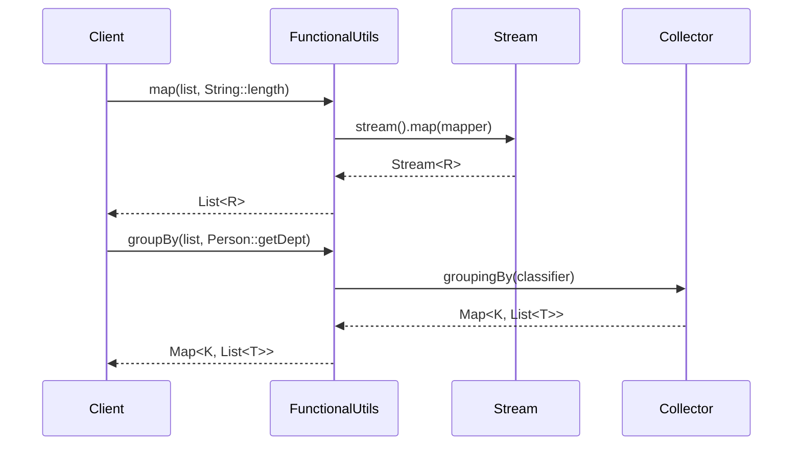
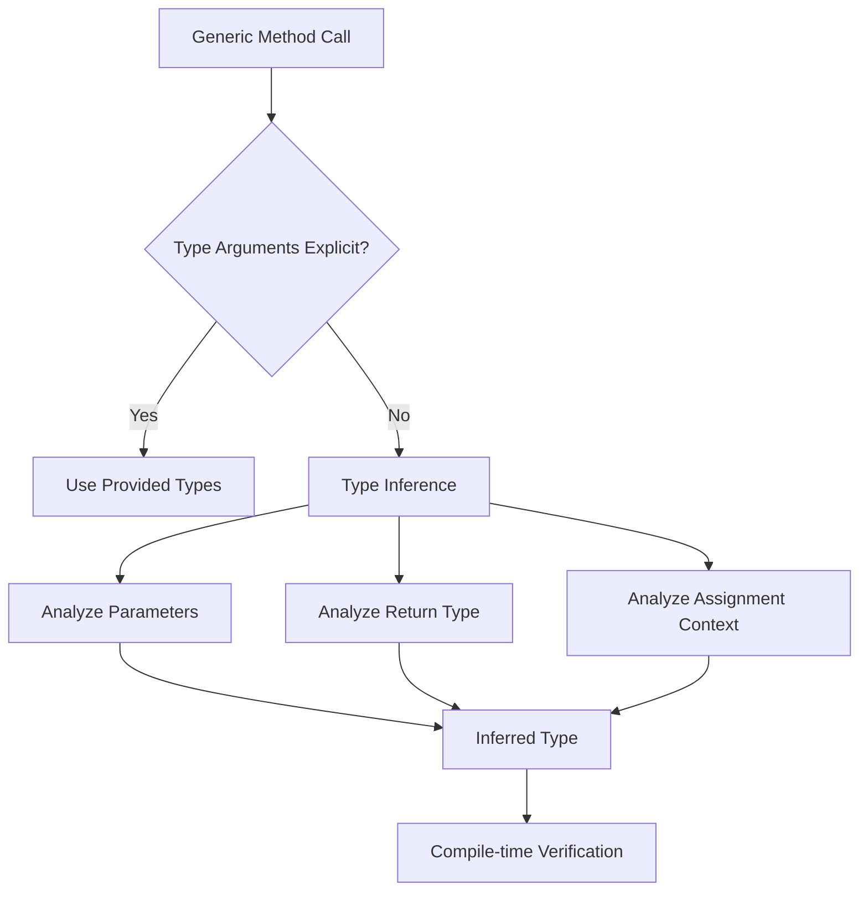

*Sensei:* Welcome to the final challenge, master-in-training. You have learned the foundations and explored bounds. Now we tackle the most sophisticated aspects of Java's generic type system.

*Deshi:* Sensei, I feel ready for the ultimate test. What advanced patterns await?

*Sensei:* Today we explore recursive bounds, type inference, complex variance patterns, and the mystical art of the Curiously Recurring Template Pattern.

## The Ultimate Challenge: Advanced Type Relationships

*Sensei:* Consider this functional programming scenario:

```java
// How do we make this type-safe with complex transformations?
List<String> names = Arrays.asList("Alice", "Bob", "Charlie");
List<Person> people = ???; // Transform strings to people
Map<Department, List<Person>> grouped = ???; // Group by department
Optional<Person> eldest = ???; // Find oldest person
```

*Deshi:* The transformations involve multiple type parameters and complex relationships!

*Sensei:* Precisely. Advanced generics allow us to express these transformations safely while maintaining type inference and performance.

## Recursive Generic Bounds (CRTP)

```mermaid
classDiagram
    class AbstractBuilder~T extends AbstractBuilder~T~~ {
        <<abstract>>
        +T validate()
        +T reset()
        +Object build()
    }
    
    class PersonBuilder {
        +PersonBuilder setName(String)
        +PersonBuilder setAge(int)
        +Person build()
    }
    
    class CarBuilder {
        +CarBuilder setMake(String)
        +CarBuilder setModel(String)
        +Car build()
    }
    
    AbstractBuilder <|-- PersonBuilder
    AbstractBuilder <|-- CarBuilder
    
    note for AbstractBuilder~T extends AbstractBuilder~T~~ "Self-referencing type\nEnsures fluent return types\nType-safe method chaining"
```

*Sensei:* The Curiously Recurring Template Pattern ensures that method chaining returns the correct concrete type:

```java
// Without CRTP - loses concrete type
public abstract class AbstractBuilder {
    public AbstractBuilder validate() { return this; }
}

// With CRTP - preserves concrete type
public abstract class AbstractBuilder<T extends AbstractBuilder<T>> {
    @SuppressWarnings("unchecked")
    public T validate() { return (T) this; }
}
```

## Advanced Functional Patterns



## Your Mission: Master Advanced Patterns

### Task 1: Implement Type-Safe Functional Utilities

Transform `FunctionalUtils` to use advanced bounds and type inference:

```java
// BEFORE (unsafe)
public static List map(List source, Function mapper) {
    // No type safety
}

// AFTER (your implementation)
public static <T, R> List<R> map(List<? extends T> source, Function<? super T, ? extends R> mapper) {
    // TODO: Implement with proper variance and bounds
}
```

*Deshi:* That signature looks complex! Let me break it down:

*Sensei:* Good approach! Each part serves a purpose:
- `<T, R>` - Input and output types
- `List<? extends T>` - Can accept subtypes of T (covariance)
- `Function<? super T, ? extends R>` - Function accepting T+ and producing R-

### Task 2: Recursive Builder Pattern (CRTP)

Implement the self-referencing builder pattern:

```java
// BEFORE
public abstract class AbstractBuilder {
    public AbstractBuilder validate() { return this; } // Loses concrete type!
}

// AFTER (your implementation)
public abstract class AbstractBuilder<T extends AbstractBuilder<T>> {
    // TODO: Implement fluent interface that preserves concrete types
    // TODO: Ensure PersonBuilder.validate() returns PersonBuilder
}
```

### Task 3: Advanced Async Cache with Complex Bounds

Implement a cache with sophisticated type relationships:

```java
// Your implementation should handle:
public class AsyncCache<K, V> {
    // TODO: Complex bounds for async operations
    public <R> CompletableFuture<R> getOrCompute(
        K key, 
        Function<? super K, ? extends CompletableFuture<? extends V>> supplier,
        Function<? super V, ? extends R> transformer
    ) {
        // TODO: Implement with proper type inference
    }
}
```

## Type Inference and Diamond Operator



*Sensei:* Modern Java can infer complex types:

```java
// Type inference in action
var people = FunctionalUtils.map(
    names,                    // List<String>
    name -> new Person(name)  // Function<String, Person>
);  // Inferred as List<Person>

// Complex inference with multiple bounds
var result = FunctionalUtils.flatMap(
    departments,                    // List<Department>
    dept -> dept.getEmployees()     // Function<Department, List<Employee>>
);  // Inferred as List<Employee>
```

## Advanced Variance Patterns

### Contravariance and Covariance Combined

```java
// Producer-Consumer with complex relationships
public static <T, R> void processAndCollect(
    List<? extends Producer<? extends T>> producers,    // Covariant producers
    Function<? super T, ? extends R> processor,         // Contra-/covariant function
    Consumer<? super R> collector                       // Contravariant consumer
) {
    producers.stream()
        .map(Producer::produce)     // T
        .map(processor)             // R
        .forEach(collector);        // consume R
}
```

## Expected Advanced Results

After mastering these patterns:

```java
// Fluent builder with preserved types
PersonBuilder person = new PersonBuilder()
    .setName("Alice")               // Returns PersonBuilder
    .setAge(30)                     // Returns PersonBuilder  
    .validate()                     // Still PersonBuilder!
    .reset();                       // Still PersonBuilder!

// Type-safe functional transformations
List<String> names = Arrays.asList("Alice", "Bob", "Charlie");
List<Integer> lengths = FunctionalUtils.map(names, String::length);
List<Person> people = FunctionalUtils.map(names, Person::new);

// Complex async operations
AsyncCache<String, User> userCache = new AsyncCache<>();
CompletableFuture<String> userName = userCache.getOrCompute(
    "user123",
    id -> fetchUserAsync(id),       // String -> CompletableFuture<User>
    user -> user.getName()          // User -> String
);  // Result: CompletableFuture<String>

// Advanced grouping and collecting
Map<Department, List<Person>> byDept = FunctionalUtils.groupBy(
    people, 
    Person::getDepartment
);

// Nested generic operations
List<List<String>> nested = Arrays.asList(
    Arrays.asList("a", "b"),
    Arrays.asList("c", "d")
);
List<String> flattened = FunctionalUtils.flatMap(nested, Function.identity());
```

## Complex Diagram: Advanced Generic Relationships

```mermaid
classDiagram
    class FunctionalUtils {
        +static ~T,R~ List~R~ map(List~? extends T~, Function~? super T, ? extends R~)
        +static ~T~ List~T~ filter(List~? extends T~, Predicate~? super T~)
        +static ~T,R~ R reduce(List~? extends T~, R identity, BinaryOperator~R~)
        +static ~T,R~ List~R~ flatMap(List~? extends T~, Function~? super T, ? extends List~? extends R~~)
        +static ~T,K~ Map~K,List~T~~ groupBy(List~? extends T~, Function~? super T, ? extends K~)
    }
    
    class AbstractBuilder~T extends AbstractBuilder~T~~ {
        <<abstract>>
        +T validate()
        +T reset()
        +abstract Object build()
    }
    
    class AsyncCache~K,V~ {
        +CompletableFuture~V~ getOrCompute(K, Supplier~CompletableFuture~V~~)
        +~R~ CompletableFuture~R~ transform(K, Function~V,R~)
        +void put(K, V, Consumer~V~)
        +Map~K,CompletableFuture~V~~ batchGet(Collection~K~)
    }
    
    note for FunctionalUtils "Complex variance patterns\nType inference support\nPECS principle applied"
    note for AbstractBuilder~T extends AbstractBuilder~T~~ "Curiously Recurring Template\nFluent interface preserved\nSelf-referencing bounds"
    note for AsyncCache~K,V~ "Async type transformations\nComplex future chaining\nType-safe caching"
```

## Advanced Concepts to Master

*Sensei:* These are the pinnacle concepts:

1. **Recursive Bounds**: `<T extends Comparable<T>>` and CRTP patterns
2. **Complex Variance**: Combining `extends` and `super` in sophisticated ways
3. **Type Inference**: Understanding how Java infers generic types
4. **Intersection Types**: Multiple bounds with `&` operator
5. **Generic Method Resolution**: How the compiler resolves overloaded generic methods
6. **Capture of Wildcards**: Understanding `capture of ?` compiler behavior
7. **Raw Types Interaction**: How generics interact with legacy code

## Type Erasure and Runtime Behavior

*Deshi:* Sensei, what happens to generics at runtime?

*Sensei:* Ah, the secret of type erasure. Generics exist only at compile time:

```java
// These are the same at runtime due to erasure
List<String> strings = new ArrayList<>();
List<Integer> integers = new ArrayList<>();

strings.getClass() == integers.getClass(); // true!

// But you can work with this limitation
public class TypeToken<T> {
    private final Type type;
    
    public TypeToken() {
        this.type = ((ParameterizedType) getClass()
            .getGenericSuperclass()).getActualTypeArguments()[0];
    }
}
```

## Testing Advanced Implementations

Run comprehensive tests:

```bash
mvn test -Dtest=FunctionalUtilsTest
mvn test -Dtest=AbstractBuilderTest  
mvn test -Dtest=AsyncCacheTest
```

## Master-Level Reflection

*Sensei:* As a master, contemplate these profound questions:

1. How does the Curiously Recurring Template Pattern solve the expression problem?
2. When would you choose complex bounds over simpler designs?
3. How do advanced generics relate to category theory concepts?
4. What are the performance implications of complex generic signatures?
5. How do you balance type safety with API usability?

*Deshi:* I see now that generics are not just about containers - they're about expressing complex relationships safely!

*Sensei:* You have achieved enlightenment. Advanced generics are the way to express complex domain relationships in type-safe ways while maintaining performance and clarity.

## The Path Forward

You have now mastered:

- Basic generic types and methods
- Bounded types and wildcards  
- Advanced variance patterns
- Recursive bounds and CRTP
- Complex functional compositions
- Type inference and capture

## Final Wisdom

*Sensei:* Remember these principles as you apply your mastery:

1. **Simplicity First**: Don't use complex generics unless they add real value
2. **Type Safety**: Prefer compile-time errors over runtime surprises
3. **API Design**: Consider the developer experience when designing generic APIs
4. **Performance**: Understand that complex bounds don't affect runtime performance
5. **Maintainability**: Complex generic code needs excellent documentation

*Deshi:* Thank you, Sensei. I feel ready to apply these advanced patterns in real-world scenarios.

*Sensei:* Go forth and create type-safe, elegant, and powerful Java applications. You have mastered the way of advanced generics.

---

*"In the mastery of advanced generics, we find the perfect balance between expressiveness and safety, between flexibility and constraint."* - The Generic Master's Creed
