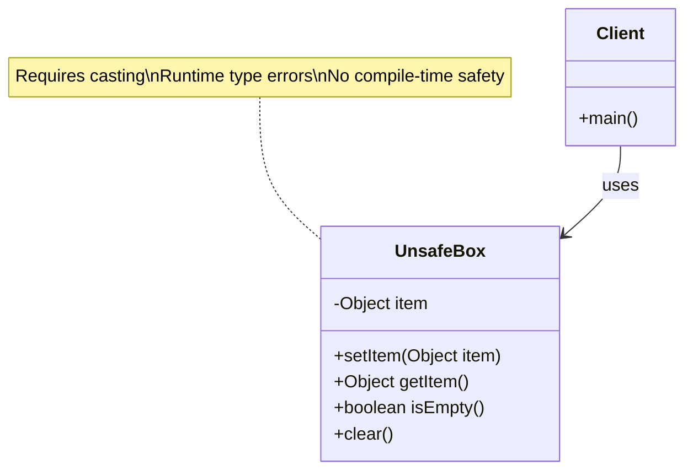
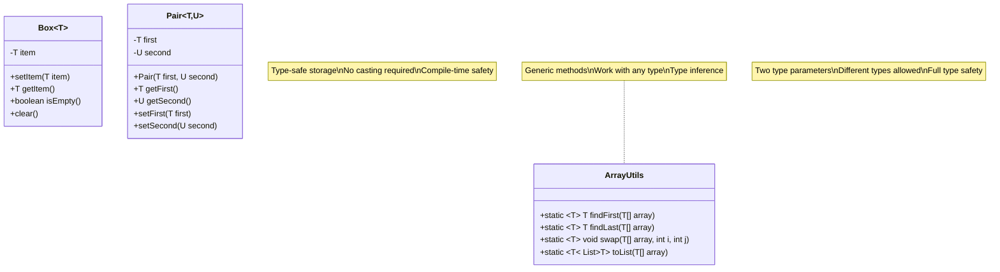

*Sensei:* Welcome, young developer. Today we begin our journey into the mystical art of Java Generics. Like a craftsman who chooses the right tool for each task, generics help us write type-safe and reusable code.

*Deshi:* Sensei, I've heard that generics are complex. Are they really necessary?

*Sensei:* Observe this simple box, student. See how it accepts any object, yet forces us to cast when retrieving?

```java
UnsafeBox box = new UnsafeBox();
box.setItem("Hello");
String value = (String) box.getItem(); // Casting required!
```

*Deshi:* Yes, and what if I accidentally put an Integer but try to cast to String?

*Sensei:* Precisely! You would face the dreaded `ClassCastException` at runtime. But with generics, such errors are caught at compile time.

## The Problem: Type Safety Without Generics



*Sensei:* The current `UnsafeBox` class stores everything as `Object`. This leads to three problems:

1. **Casting Required**: You must cast the retrieved object
2. **Runtime Errors**: Wrong casts cause `ClassCastException`
3. **No Type Safety**: The compiler cannot help you

## Your Mission

Transform the unsafe classes into type-safe generic versions:

### Task 1: Generic Box Class

Convert `UnsafeBox` to a generic `Box<T>` class:

```java
// BEFORE (unsafe)
public class UnsafeBox {
    private Object item;
    
    public void setItem(Object item) {
        this.item = item;
    }
    
    public Object getItem() {
        return item;
    }
}

// AFTER (your implementation)
public class Box<T> {
    // TODO: Convert to generic implementation
}
```

*Deshi:* How do I make it generic, Sensei?

*Sensei:* Replace `Object` with the type parameter `T`. The angle brackets `<T>` declare that this class accepts a type parameter.

### Task 2: Generic Utility Methods

Convert the `ArrayUtils` methods to use generics:

```java
// BEFORE
public static Object findFirst(Object[] array) {
    // Returns Object - requires casting
}

// AFTER (your implementation)
public static <T> T findFirst(T[] array) {
    // TODO: Implement generic version
}
```

### Task 3: Generic Pair Class

Convert the `Pair` class to hold two potentially different types:

```java
// BEFORE
public class Pair {
    private Object first;
    private Object second;
}

// AFTER (your implementation)  
public class Pair<T, U> {
    // TODO: Convert to generic with two type parameters
}
```

## Expected Results

After implementing generics, your code should work like this:

```java
// Type-safe box usage
Box<String> stringBox = new Box<>();
stringBox.setItem("Hello");
String value = stringBox.getItem(); // No casting needed!

Box<Integer> intBox = new Box<>();
intBox.setItem(42);
Integer number = intBox.getItem(); // Type-safe!

// Generic utility methods
String[] names = {"Alice", "Bob", "Charlie"};
String first = ArrayUtils.findFirst(names); // Returns String

Integer[] numbers = {1, 2, 3};
Integer firstNum = ArrayUtils.findFirst(numbers); // Returns Integer

// Generic pair
Pair<String, Integer> nameAge = new Pair<>("Alice", 25);
String name = nameAge.getFirst(); // Returns String
Integer age = nameAge.getSecond(); // Returns Integer
```

## Class Diagram After Generics



## Key Concepts to Master

*Sensei:* Focus on these fundamental concepts:

1. **Type Parameters**: `<T>` declares a placeholder for a type
2. **Generic Classes**: `class Box<T>` - the class accepts a type parameter
3. **Generic Methods**: `<T> T methodName()` - the method has its own type parameter
4. **Multiple Type Parameters**: `<T, U>` - classes and methods can have multiple parameters
5. **Type Safety**: Generics prevent `ClassCastException` at compile time

*Deshi:* What does the `T` stand for?

*Sensei:* `T` is convention for "Type". You could use any name, but follow these conventions:
- `T` - Type (general purpose)
- `E` - Element (collections)
- `K` - Key (maps)
- `V` - Value (maps)
- `N` - Number

## Running the Tests

Execute your tests to verify the implementation:

```bash
mvn test -Dtest=UnsafeBoxTest
```

The tests will guide you through the transformation from unsafe to type-safe code.

## Reflection Questions

*Sensei:* Before we conclude, meditate on these questions:

1. How do generics improve code safety?
2. What happens if you try to put a wrong type in a generic container?
3. Why is compile-time error detection better than runtime errors?
4. How do generics make code more readable?

*Deshi:* This seems much safer than casting everything!

*Sensei:* Indeed. You have taken the first step into the world of type-safe programming. Remember: *"In generics, we find safety without sacrificing flexibility."*

## Next Steps

Once you master these basics, you'll be ready for:
- Bounded type parameters (`<T extends Number>`)
- Wildcards (`<? extends T>`, `<? super T>`)
- Generic inheritance and complex type relationships

Practice well, and the path to generic mastery will unfold before you.

---

*"The wise programmer writes once, compiles safely, and runs without fear of casting exceptions."* - Ancient Java Proverb
