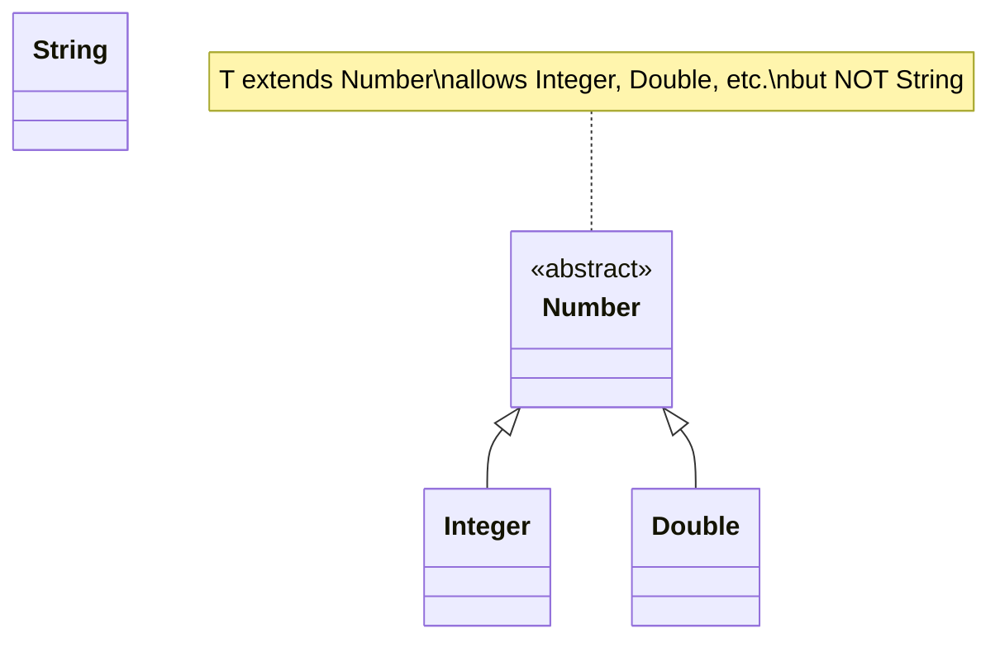
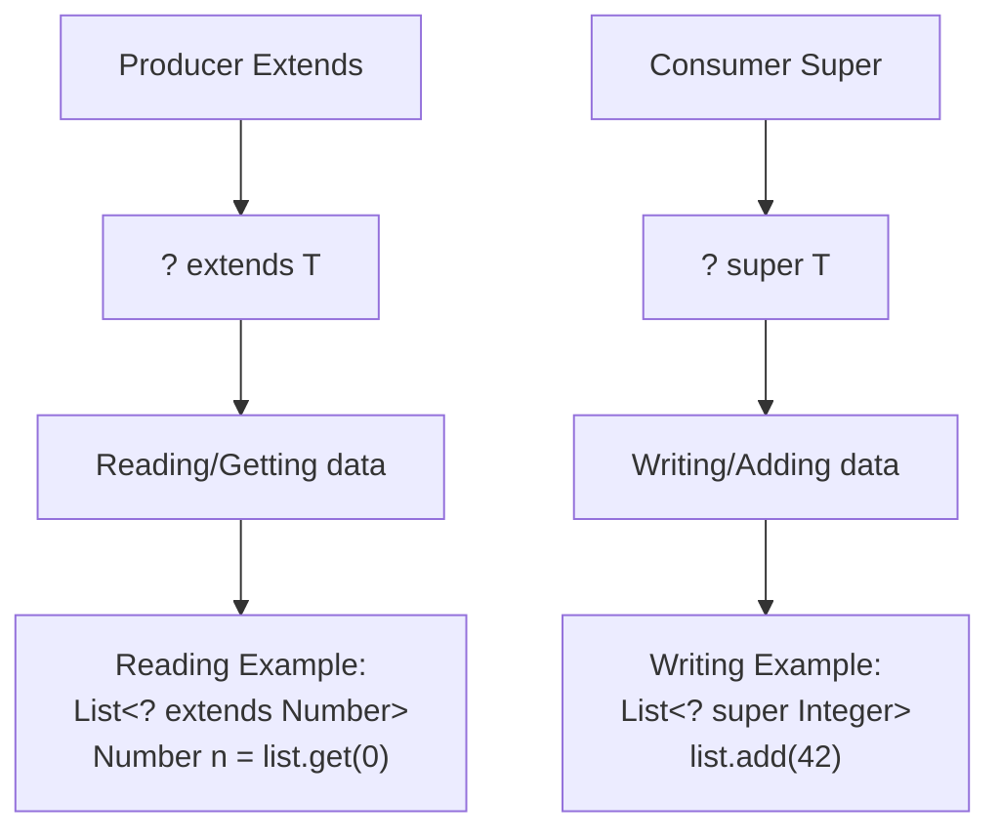
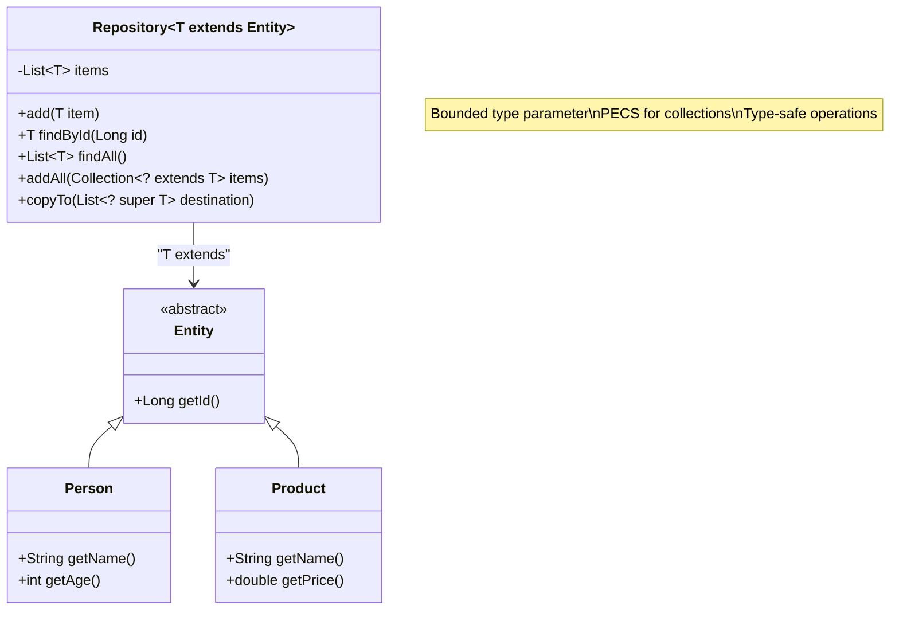
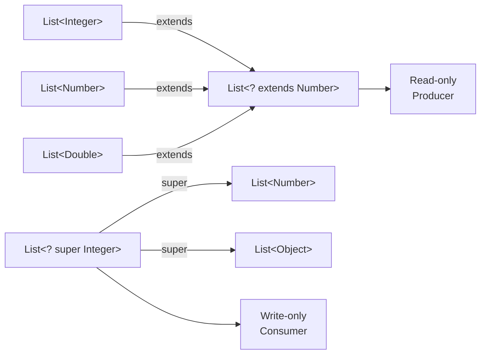

## Pre-Dialog Knowledge Check

Before diving into advanced generics, test your understanding of intermediate concepts:

### Question 1: What does the bounded type parameter `<T extends Number>` accomplish?

a) It makes T faster at runtime
b) It constrains T to be Number or any of its subtypes
c) It allows T to extend multiple classes
d) It makes the code compile faster

### Question 2: In the PECS principle, what does "Producer Extends" mean?

a) Producers should extend Object
b) When reading from a collection, use `<? extends T>`
c) Producers must implement the Extends interface
d) Extended classes produce more objects

### Question 3: What's wrong with this code?

```java
List<? extends Number> numbers = new ArrayList<Integer>();
numbers.add(42); // Attempting to add Integer
```

a) Nothing is wrong, it will work fine
b) You can't add to a list with upper bound wildcards
c) Integer is not a Number
d) The list should be `List<Number>`

> Answers : 1:b;2:b;3:b

---

*Sensei:* Excellent progress, my student! You have mastered basic generics. Now we venture into deeper waters - bounded types and wildcards.

*Deshi:* Sensei, I'm comfortable with `<T>`, but what about `<T extends Number>` and `<? super T>`?

*Sensei:* Ah, you seek to understand constraints and variance. These are the tools that allow generics to express complex type relationships safely.

## The Challenge: Beyond Simple Type Parameters

*Sensei:* Consider this repository pattern. It should store entities, but currently accepts any `Object`:

```java
Repository repo = new Repository();
repo.add("String");        // Should this be allowed?
repo.add(new Person());    // What about this?
repo.add(new Product());   // Or this?
```

*Deshi:* I see the problem. Without bounds, we lose the benefit of knowing what types are related.

## Understanding Bounded Type Parameters



*Sensei:* Observe the power of bounds:

```java
// Without bounds - accepts anything
public class Container<T> {
    public void process(T item) {
        // What methods can you call on T? Only Object methods!
        System.out.println(item.toString());
    }
}

// With bounds - constrains T to Number subtypes  
public class NumberContainer<T extends Number> {
    public void process(T item) {
        // Now you can call Number methods!
        double value = item.doubleValue();
        System.out.println("Value: " + value);
    }
}
```

## The PECS Principle: Producer Extends, Consumer Super

*Deshi:* Sensei, when should I use `extends` vs `super` with wildcards?

*Sensei:* Remember PECS - Producer Extends, Consumer Super:



## Your Mission

Transform these classes to use proper bounded generics and wildcards:

### Task 1: Generic Repository with Entity Bounds

Convert the `Repository` to work with entities:

```java
// BEFORE
public class Repository {
    private List<Object> items = new ArrayList<>();
    
    public void add(Object item) {
        items.add(item);
    }
    // ... other methods
}

// AFTER (your implementation)
public class Repository<T extends Entity> {
    // TODO: Add proper bounds and wildcards
    // TODO: Implement PECS pattern for collections
}
```

*Sensei:* The repository should only accept entities that extend `Entity`, ensuring type safety.

### Task 2: Sorting Utilities with Comparable Bounds

Fix the `SortingUtils` to work safely with comparable types:

```java
// BEFORE (unsafe)
public static void sort(List list) {
    list.sort(null); // Fails at runtime if not Comparable!
}

// AFTER (your implementation)
public static <T extends Comparable<? super T>> void sort(List<T> list) {
    // TODO: Implement with proper bounds
}
```

*Deshi:* That bound looks complex! What does `<? super T>` mean?

*Sensei:* It means T can compare itself to T or any supertype of T. This handles inheritance properly.

### Task 3: Advanced Collection Operations

Implement methods that demonstrate PECS:

```java
public class CollectionUtils {
    
    // Producer - reading from source
    public static <T> void copy(List<? extends T> source, List<? super T> destination) {
        // TODO: Implement copy with proper wildcards
    }
    
    // Consumer - writing to collection
    public static <T> void addAll(List<? super T> target, T... items) {
        // TODO: Implement addAll with proper bounds
    }
}
```

## Complex Generic Relationships



## Expected Results

After implementing bounds and wildcards:

```java
// Bounded repository
Repository<Person> personRepo = new Repository<>();
Person person = new Person(1L, "Alice", 25);
personRepo.add(person);

// This won't compile - String doesn't extend Entity
// Repository<String> stringRepo = new Repository<>(); // Compile error!

// PECS in action
List<Person> people = Arrays.asList(person);
List<Entity> entities = new ArrayList<>();

// Producer extends - can read Person as Entity
CollectionUtils.copy(people, entities); // Works!

// Consumer super - can add Person to Entity list  
List<Object> objects = new ArrayList<>();
CollectionUtils.copy(people, objects); // Works!

// Sorting with bounds
List<Integer> numbers = Arrays.asList(3, 1, 4, 1, 5);
SortingUtils.sort(numbers); // Type-safe sorting!

// This won't compile - Object is not Comparable
// List<Object> objects = Arrays.asList(new Object());
// SortingUtils.sort(objects); // Compile error!
```

## Variance in Action



## Key Concepts to Master

*Sensei:* Focus on these intermediate concepts:

1. **Bounded Type Parameters**: `<T extends Number>` constrains T to Number subtypes
2. **Upper Bounds**: `<? extends T>` - covariance for producers (reading)
3. **Lower Bounds**: `<? super T>` - contravariance for consumers (writing)
4. **PECS Principle**: Producer Extends, Consumer Super
5. **Multiple Bounds**: `<T extends Number & Comparable<T>>` 
6. **Generic Method Bounds**: Methods can have their own bounded type parameters

## Advanced Patterns

### Recursive Bounds

```java
// Comparable that compares to itself
public interface Comparable<T> {
    int compareTo(T other);
}

// Enum with recursive bound
public abstract class Enum<E extends Enum<E>> {
    // E must be a subtype of Enum<E>
}
```

### Intersection Types

```java
// Multiple bounds with &
public static <T extends Number & Comparable<T>> T max(T a, T b) {
    return a.compareTo(b) > 0 ? a : b;
}
```

## Testing Your Implementation

Run the tests to verify your bounded generics:

```bash
mvn test -Dtest=RepositoryTest
mvn test -Dtest=SortingUtilsTest
```

## Common Pitfalls

*Deshi:* What mistakes should I avoid?

*Sensei:* Be mindful of these traps:

1. **Mixing Extends and Super**: Don't use both in the same declaration
2. **Forgetting PECS**: Use `extends` for reading, `super` for writing
3. **Over-constraining**: Don't add bounds unless you need them
4. **Generic Array Creation**: `new T[10]` doesn't work - use collections instead

## Post-Kata Knowledge Check

Now that you've mastered bounded generics and wildcards, test your advanced understanding:

### Question 1: What's the difference between `<T extends Comparable<T>>` and `<T extends Comparable<? super T>>`?

a) There is no difference, they're equivalent
b) The second allows T to compare with its supertypes, handling inheritance better
c) The first is faster at runtime
d) The second only works with primitive types

### Question 2: In a method signature like `void process(List<? super Integer> list)`, what can you safely do?

a) Add Integer objects to the list
b) Read Integer objects from the list
c) Both add and read Integer objects
d) Neither add nor read objects

### Question 3: Given `Repository<T extends Entity>`, which statement is true?

a) T can be any type
b) T must be exactly the Entity class
c) T must be Entity or any class that extends Entity
d) T must extend at least two interfaces

> Answers : 1:b;2:a;3:c

---

## Reflection Questions

*Sensei:* Contemplate these deeper truths:

1. When would you use `<T extends Comparable<T>>` vs `<T extends Comparable<? super T>>`?
2. How do wildcards enable safe variance in Java's type system?
3. Why can't you add to a `List<? extends T>`?
4. When would you need multiple bounds like `<T extends A & B>`?

*Deshi:* I'm starting to see how bounds create a safety net while preserving flexibility!

*Sensei:* Precisely. Bounds are the bridge between strict type safety and flexible reusability.

## Next Steps

Master these concepts before advancing to:
- Complex recursive bounds and self-types
- Generic method type inference
- Advanced variance patterns in functional programming

---

*"In bounded generics, we find the harmony between constraint and freedom."* - Ancient Java Wisdom
